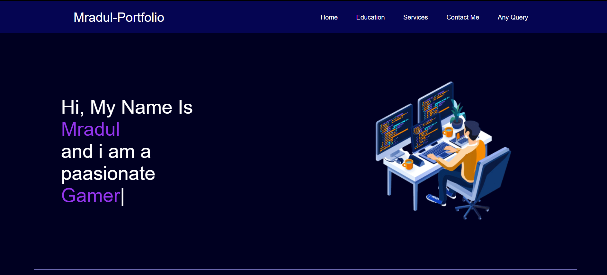

# 🌐 Mradul's Portfolio

Welcome to my personal portfolio website!  
This portfolio showcases my education, skills, services, and projects.  
It also includes a contact form so visitors can reach out to me.

---

## 🚀 Features
- Responsive and modern design
- Navigation bar with smooth links
- Hero section with typing animation
- Services section (Web Development, React, Node.js, etc.)
- Education timeline (High School → Intermediate → Diploma → B.Tech)
- Contact form section
- Footer with quick links & social media

---

## 🛠️ Technologies Used
- **HTML5**  
- **CSS3**  
- **JavaScript**  
- **Typed.js** (for typing animation)  

---

## 📂 Project Structure

---

## 📸 Preview

---

## 📬 Contact
- **Name**: Mradul Agrahari  
- **Email**: [mradul.golu.agrahari.2003@gmail.com](mailto:mradul.golu.agrahari.2003@gmail.com)  
- **LinkedIn**: [Mradul Agrahari](https://www.linkedin.com/in/mradul-agrahari-262521235/)  
- **GitHub**: [Mradul2402](https://github.com/Mradul2402)  

---

⭐ If you like this project, don’t forget to **star the repository**!
